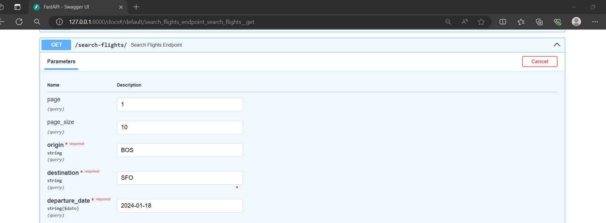
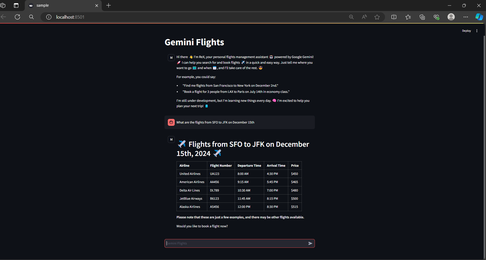

# Gemini - Flight Manager Chatbot

## Overview
The Gemini Flight Manager is a powerful backend system constructed with FastAPI, aimed at managing and simulating flight-related tasks. This system offers a solid platform to handle various facets of flight management, such as flight creation, search, and booking functions.

Utilizing FastAPI's efficient and user-friendly framework, the project delivers a high-performance, scalable solution tailored for managing flight data. It includes an SQLite database (flights.db) that comes pre-loaded with initial data, facilitating quick deployment and testing.

Key features of Gemini Flight Manager include:
- Advanced Search Capabilities: Allows querying flights based on parameters such as origin, destination, and dates.
- Booking System: Manages seat availability across various classes and calculates costs accordingly.

For the purposes of Gemini Function Calling, you will only need `search_flights` and `book_flight` functions.

Watch the demo video [here](assets/Recording.mp4).
<video width="600" controls>
  <source src="https://github.com/ChaitanyaKumarBattula/Gemini_FlightsManager_bot/raw/main/assets/Recording.mp4" type="video/mp4">
</video>

## Requirements
Before you begin, make sure you have the following installed on your system:

- Python 3.6 or higher
- FastAPI
- Uvicorn: An ASGI server for FastAPI

These components are essential to run and develop with the Gemini Flight Manager.
## Detailed Tasks
1. Task✨ Configuring Google Gemini
2. Task: Clone Prebuilt FastAPI Server
3. Task☁️ Google Cloud Developer Setup
4. Task📞 Implement Function Calling with Tools
5. Task📊 Integrate with Streamlit
6. Task✈️ Develop the Book_Flight Tool


## 1. Task✨ Configuring Google Gemini
- Visit the Google Cloud Platform and click on "Get Started for free."
- Sign in with your Google Account, provide the required information, and complete the billing setup.
- Agree to the terms and conditions.
- Finalize the payment process to set up your Google Cloud Account.
- Create a new project (e.g., "Gemini Flight").
- Access the Google Cloud Console.
- Navigate to the `Vertex AI` section and `enable all recommended APIs`.

## 2. Task: Clone Prebuilt FastAPI Server
### Cloning the Repository
Begin by cloning the repository to your local machine using the following commands:
```sh
git clone https://github.com/your-username/your-repository.git
cd your-repository
```
### Set Up a Virtual Environment (Optional but Recommended)
It's advisable to create a virtual environment for your Python projects to keep dependencies isolated. If you have virtualenv installed, create a new environment with:
```sh
python3 -m venv env
```
```sh
source env/bin/activate
```
### Install necessary packages
```sh
pip install -r requirements.txt
```
### Starting the FastAPI Server
Once the dependencies are installed, you can start the FastAPI server using Uvicorn. Navigate to the project directory and run:
```sh
uvicorn main:app
```
### Accessing the API
With the server running, access the API at http://127.0.0.1:8000. For interactive API documentation, visit http://127.0.0.1:8000/docs, where you can test the API endpoints directly from your browser.

* **Testing the Endpoints**
    To search for flights, use the following parameters:
    -   Origin: BOS
    -   Destination: SFO
    -   Date: 2024-03-17


## 3. Task☁️ Google Cloud Developer Setup
- Download and Install: Follow the instructions on the Google Cloud SDK installation page to download and install the SDK.
- Initialize: gcloud to initialize the SDK.
```sh
Run gcloud init 
```
- Log In: Sign in with your Google Account credentials when prompted.
- Project Selection: Choose an existing project or create a new one.
- Optional Configuration: Set the default compute region and zone during the initialization process if desired.

## 4. Task📞 Implement Function Calling with Tools
- Creating the get_search_flights Function: Use a FunctionDeclaration to define the get_search_flights function.
- Encapsulating in a Tool Class: Wrap the get_search_flights function within a Tool class.
- Setting Up the Generative Model: Configure the GenerativeModel to use the encapsulated function.

## 5. Task📊 Integrate with Streamlit
- Developed a response handling system and integrated it with Streamlit to facilitate efficient communication with Google Gemini.

## 6. Task✈️ Develop the Book_Flight Tool
* **Developed the book_flight Function:**
    - Added the book_flight function in Flight_Manager.py which sends a POST request to the prebuilt endpoint.
* **Created FunctionDeclaration:**
    - Created a new FunctionDeclaration for the book_flight_tool.
* **Encapsulated Tools:**
    - Encapsulated the book_flight_tool along with the search_tool.
* **Configured the Model:**
    - Configured the model to use both encapsulated tools.


## Working of the Model:

